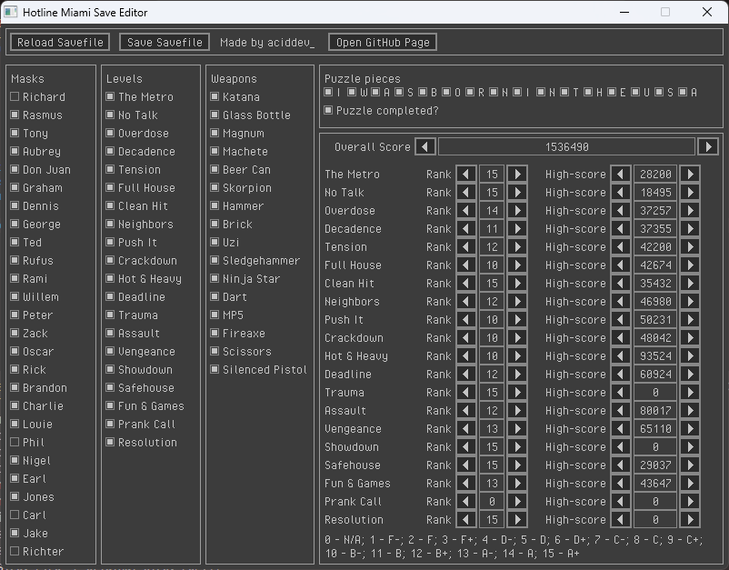

# hm-savedit
full-blown hotline miami save editor, that supports new (updated) version of the game

## quickstart
to use the thing download the latest release and run it.

it _should_ find a savefile and load it automagically, but, in case something goes wrong,
you can load it yourself, using load savefile button on top. select a savedata.sav file in
%USERPROFILE%\My Games\HotlineMiami\ and select it.

after changes, hit save savefile button, and you are good to go.

## gallery

## build instructions
msys2: `$ make windows`
